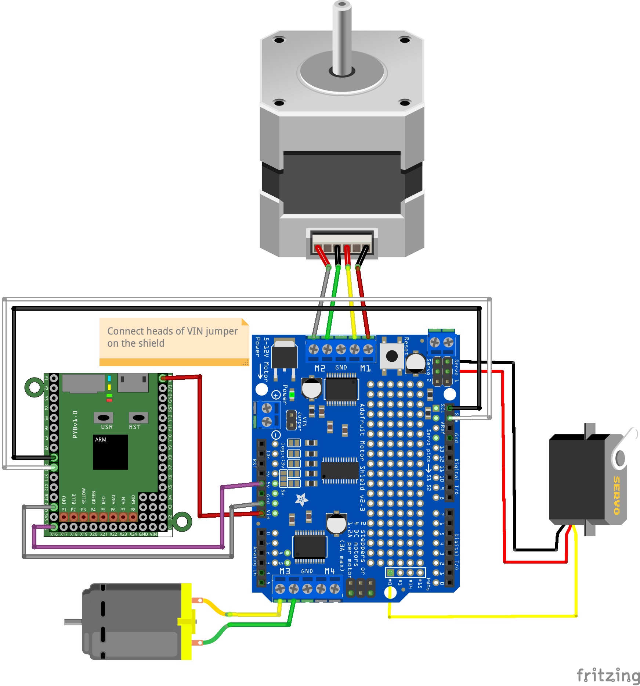
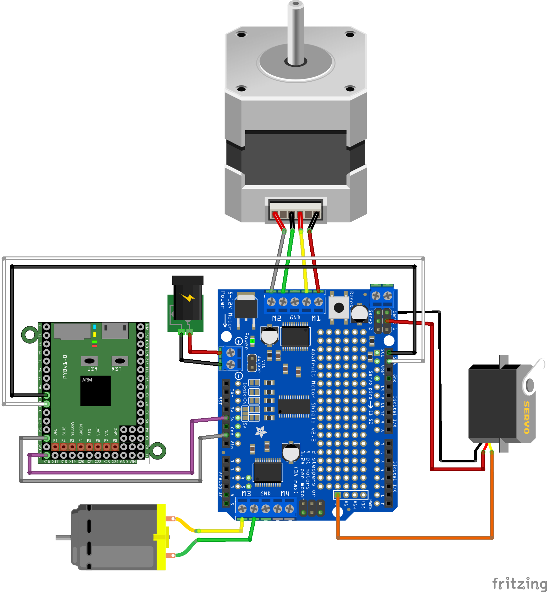
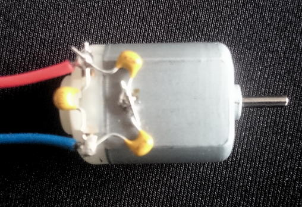

# Micropython modules for Adafruit motor shield V2
These are Micropython modules for Adafruit's [motor shield v2](https://learn.adafruit.com/adafruit-motor-shield-v2-for-arduino)  
They should work with both the ESP32 and the Pyboard, using either pyb.I2C or machine.I2C

* pca9685fb.py is a module for driving the PWM timer chip
* adamotshv2fb.py is a module for controlling stepper motors, DC motors and servomotors using the shield

Examples of use are in MotorShield_test.py with the following connections, the top one is when you power the motors using the pyboard, the second one is when you use an external power supply:

If you have communications problem over the I2C bus when using DC motors, you should add 100nF capacitors to filter out perturbations as follows:

You may try first with just one capacitor between the two terminals of the motor.

© Frédéric Boulanger <frederic.softdev@gmail.com>  
2019-08-27 -- 2021-05-13  
This software is licensed under the Eclipse Public License 2.0
